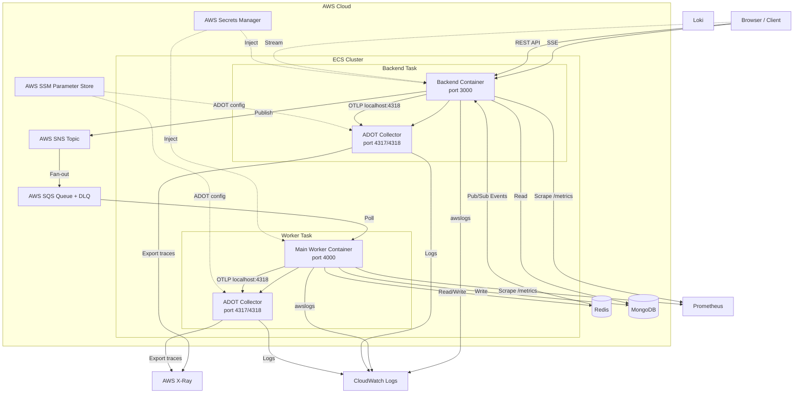
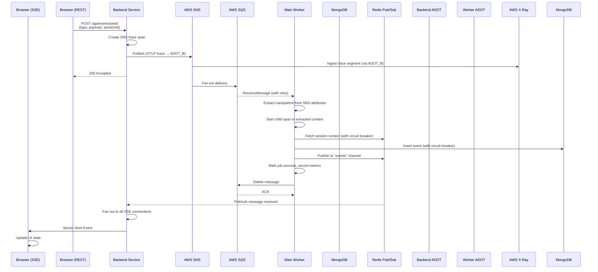

# Architecture

## Overview

This system implements an event-driven, serverless-first architecture built on AWS managed services and container orchestration. The design prioritizes loose coupling between producers and consumers, fault-resilient asynchronous processing, and production-grade observability without coupling application logic to infrastructure concerns.

The core design pattern is **fire-and-forget event ingestion with resilient background processing**: clients submit events through a thin API layer, which fans events out through a messaging pipeline. Background workers consume events asynchronously, persist them, and broadcast results via pub/sub for real-time frontend updates via Server-Sent Events (SSE).

---

# System Overview

## Backend Service

The backend service is an Express.js API running as an AWS ECS Fargate task. It serves as the entry point for all client requests. It handles session management, REST endpoints for event submission and retrieval, and acts as an SSE server for real-time event push to connected browsers. It publishes events to AWS SNS rather than processing them synchronously, keeping the API response path short and decoupled from downstream processing.

## Worker Service

The worker service is a Node.js consumer process running in ECS Fargate. It continuously polls an SQS queue for messages, processes them (enriching with session context from Redis, persisting to MongoDB), and publishes results back to Redis pub/sub. It implements resilience patterns including circuit breakers for database and Redis calls, bounded retry with exponential backoff for SQS operations, and automatic DLQ routing after max retry exhaustion.

## Event-Driven Processing

Events flow through an AWS-native fan-out pipeline: Backend → SNS Topic → SQS Queue → Worker. This provides durability, load leveling, and replayability. SNS provides at-least-once delivery to SQS, which acts as a durable buffer between producers and consumers.

## Redis Pub/Sub

Redis serves two roles: session state storage and real-time event distribution. After the worker persists an event to MongoDB, it publishes the event to a Redis `events` channel. The backend subscribes to this channel and broadcasts events to all connected SSE clients. This pub/sub layer decouples the worker's completion from the backend's delivery logic, avoiding coupling to specific backend instances.

## MongoDB

MongoDB is the primary persistence layer. Events are stored with full context including session enrichment data. The backend reads from MongoDB for paginated event history. Both backend and worker share the same MongoDB cluster via Secrets Manager-injected connections.

## OpenTelemetry Observability

All components emit OpenTelemetry traces via the OTLP protocol to a local ADOT (AWS Distro for OpenTelemetry) Collector sidecar. The collector batches and exports traces to AWS X-Ray. This architecture keeps tracing instrumentation inside application code while exporting logic runs in a separate, configurable sidecar, avoiding vendor lock-in at the library layer.

## AWS Managed Services

The system offloads operational complexity to AWS managed services: ECS Fargate for compute, SNS for pub/sub event routing, SQS for durable queuing, Secrets Manager for credential lifecycle, and SSM Parameter Store for collector configuration. This eliminates the need to operate Kafka, Redis Sentinel, or self-hosted monitoring infrastructure.

---

# High-Level Architecture



---

# Infrastructure

## AWS Region

All resources are deployed in `us-east-1`. This region was selected for operational familiarity, lowest-cost Fargate Spot pricing, and proximity to managed services endpoints. The SQS queue, SNS topic, Secrets Manager secrets, and SSM parameters are all scoped to this region.

## ECS Cluster

The `ecs-cluster` is a minimal Fargate-only cluster. No EC2 instances are managed. The cluster uses both `FARGATE` and `FARGATE_SPOT` capacity providers, with Fargate Spot as the preferred capacity. Spot interruption risk is acceptable because events are durable in SQS — an interrupted task simply restarts and resumes polling without data loss.

ECS was chosen over alternatives for these reasons:

- **vs Lambda**: Lambda has cold start variance, 15-minute execution limits, and concurrency burst limits that complicate long-running polling workers. Fargate allows predictable performance and unlimited runtime.
- **vs EKS/Kubernetes**: Kubernetes introduces operational complexity (etcd, control plane management) that is unnecessary for a two-service architecture. ECS Fargate provides sufficient scheduling semantics with far less moving parts.
- **vs EC2 Auto Scaling Groups**: No instance-level patching, SSH access, or capacity planning is required.

## ECS Services

Two services are defined: `backend-service` and `main-worker-service`. Each is configured with `DesiredCount: 1` for the current scale, but the service definition supports arbitrary scaling through the ECS console or CloudFormation stack updates. The services use `awsvpc` network mode with public IP assignment enabled, suitable for the single-subnet deployment model.

Services reference task definitions, IAM roles, and log groups, and import cross-stack values (queue ARNs, topic ARNs, secret ARNs) using `Fn::ImportValue`. This enforces stack isolation and makes infrastructure reusable across dev/staging/prod environments.

## Fargate Spot

Fargate Spot is used to reduce compute costs by approximately 70% compared to on-demand Fargate. Spot interruption is handled transparently by ECS, which marks the task for replacement. Because SQS message visibility timeouts and the worker's internal retry logic preserve message durability, a Spot interruption results in at most a processing delay of one visibility timeout period (typically 30 seconds). No checkpoint coordination is required between tasks.

## Networking

Each task uses `awsvpc` networking with a single public subnet. The subnet ID is parameterized in the CloudFormation template, allowing environment-specific reuse. Public IP assignment is enabled because the tasks need outbound connectivity to reach SQS, SNS, MongoDB, Redis, and Secrets Manager.

Tasks do not need inbound traffic from the internet — they are consumers of client requests routed through SNS/SQS and SSE streams from the backend. In a production hardening phase, this would move to private subnets with a Network Load Balancer or API Gateway for inbound traffic.

## Task Sizing

Both tasks are sized at 256 CPU units (0.25 vCPU) and 512 MB memory. This is the minimum viable Fargate allocation for the Express.js backend and the Node.js worker. The ADOT collector sidecar adds approximately 50 MB of resident memory overhead. Event processing is latency-tolerant (the SSE and REST API are the latency-sensitive paths, and both are minimal), so this allocation is appropriate for the event throughput characteristics. Memory pressure signals can be observed via the worker's `updateMemoryUsage` Prometheus gauge.

---

# Container Architecture

## Sidecar Pattern

Both the backend and worker task definitions run two containers per task. The primary container executes application code; a secondary `adot-collector` container runs the AWS Distro for OpenTelemetry Collector. Containers within the same task share `localhost` networking, so application code sends OpenTelemetry spans to `http://localhost:4318/v1/traces` without knowing the collector is a separate process.

```
[App Container] --localhost:4318--> [ADOT Collector Container]
                                       |
                                       v
                                 [AWS X-Ray / SSM Config]
```

This pattern is used for several reasons:

1. **Separation of concerns**: Application developers write OpenTelemetry SDK code against standard OTLP interfaces. Ops teams can reconfigure observability backends (switch from X-Ray to another exporter, change batching windows, add processors) without redeploying application containers.
2. **Resource isolation**: The collector has its own memory and CPU limits, preventing instrumentation from affecting application performance.
3. **Shared telemetry pipeline**: Both backend and worker use the same collector image and configuration source (`observability/adot-config` in SSM Parameter Store), ensuring consistent trace formatting and reducing configuration drift.

## Application Container

The backend container runs Express on port 3000. The worker container runs the SQS polling loop and exposes Prometheus metrics on port 4000 via a metrics server. Both containers receive configuration through environment variables for non-sensitive values and through Secrets Manager (or SSM for the collector) for credentials.

## ADOT Collector

The collector uses the config-from-environment pattern: the CloudFormation template injects the SSM parameter ARN as a Kubernetes-style secret, and the collector reads the actual YAML configuration from the `AOT_CONFIG_CONTENT` environment variable at runtime. The configuration exports OTLP receivers to AWS X-Ray via the `awsxray` exporter. The `batch` processor groups spans to reduce API call volume, and the `memory_limiter` processor prevents OOM conditions under burst load.

---

# Backend Service

## Responsibilities

The backend is the system's external interface. It has three core responsibilities: accept client requests, publish events into the async processing pipeline, and deliver real-time results back to clients.

## REST API

The Express application serves three route groups under `/api`: session management (`session-routes`), event operations (`event-routes`), and health checks (`health-routes`). The event controller exposes:

- `GET /api/events` — paginated event history from MongoDB
- `POST /api/events/send` — fires an event into the SNS pipeline
- `GET /api/events/stream` — SSE endpoint for real-time pushes

A randomized 0–1000ms delay middleware on `/events/send` adds artificial jitter to simulate variable processing latency, useful for testing the real-time UI behavior.

## MongoDB Access

The backend reads events from MongoDB for the `GET /api/events` endpoint. It does not write events — writes are the worker's responsibility. This separation ensures the API path does not perform I/O-heavy persistence work, keeping response times low.

## Redis Usage

The backend subscribes to the Redis `events` pub/sub channel in its startup sequence (`subscribeToEvents`, `listenToEvents`). When a message arrives from Redis, it is broadcast to all connected SSE clients stored in `app.locals.eventClients` — a `Map` of client ID to response objects. Redis was selected for this role because pub/sub is low-latency, requires no message durability (events are already in MongoDB), and avoids coupling the SSE broadcaster to a specific backend instance.

## SNS Publishing

For `POST /api/events/send`, the backend serializes the event payload and publishes to an SNS topic. The topic ARN and SQS queue ARN are injected as secrets. The backend does not subscribe to the SNS topic directly; SNS fans out to SQS, which provides durability and consumer abstraction. This decouples the producer (backend) from the consumer (worker) and makes the system resilient to backend restarts during high event volume.

## Server-Sent Events

The SSE endpoint maintains long-lived HTTP connections to browsers. Each connection is stored in a `Map` keyed by client ID. A 25-second heartbeat keeps connections alive through load balancers and NAT gateways. On disconnect, the client record is cleaned up and memory is released. SSE was selected over WebSockets because the use case is unidirectional server-to-client streaming with minimal overhead, and SSE is natively supported by the browser `EventSource` API without additional client libraries.

## Prometheus Metrics

The backend exposes `/metrics` using `prom-client`. Three custom metrics are tracked:

- `http_request_duration_seconds` (Histogram) — request latency by method, route, and status code
- `http_requests_total` (Counter) — request volume by method, route, and status code
- `active_connections` (Gauge) — concurrent in-flight requests

These are scraped by an external Prometheus instance at a 5-second interval for the backend service.

## OpenTelemetry Instrumentation

The backend initializes OpenTelemetry in `config/otel.js` via `startTracing()`, which configures the OTLP exporter to `http://localhost:4318/v1/traces`. Express middleware instruments each incoming request, producing spans with route, method, and status attributes. Instrumentation is applied before route handlers but is bypassed for `/metrics` to avoid recursive metric scraping affecting trace data.

---

# Worker Service

## Responsibilities

The worker is the system's processing engine. It owns message lifecycle: receive from SQS, enrich, persist, and broadcast. It is stateless and horizontally scalable.

## SQS Polling

The worker runs a synchronous `while(true)` poll loop. It calls `receiveMessages` with retry logic (3 retries, 500ms base delay, 5s cap). The `RetryService` is a bounded exponential backoff implementation that retries transient network errors (`ECONNRESET`, `ETIMEDOUT`, `ServiceUnavailable`, `RequestTimeout`) while failing fast on permanent errors.

Messages are processed in parallel using `Promise.all` when multiple messages are received in a single poll. The `queueDepth` Prometheus gauge is updated each poll cycle to reflect the number of messages in flight.

## Message Processing

Each message originates from SNS and is delivered through SQS. The worker extracts the original `traceparent` from SNS message attributes to propagate distributed tracing context across the SNS → SQS boundary. Context is extracted via `propagation.extract()` and a child span is started within that context using `context.with()`. This preserves the causal trace chain from the backend's `/events/send` handler through the messaging layer into the worker.

Message processing includes:

1. SNS message envelope parsing
2. Session enrichment via Redis (if `sessionId` is present)
3. Artificial work simulation (configurable duration)
4. MongoDB event insertion via circuit-breaker-protected database call
5. Redis pub/sub broadcast of the new event

## Session Enrichment

If the originating event includes a `sessionId`, the worker fetches session context from Redis to attach `sessionContext` (including user identity) to the event document. This allows events to be attributed to users and authenticated sessions without the original API caller sending the full user object into the messaging pipeline.

## Circuit Breakers

Two circuit breakers protect the worker from cascading failures:

- **Database Circuit Breaker** (`dbCircuitBreaker`): threshold of 1 failure, 30-second reset. A single MongoDB failure opens the circuit, preventing further database calls until recovery is confirmed.
- **Redis Circuit Breaker** (`redisCircuitBreaker`): threshold of 3 failures, 30-second reset. Allows more slack because Redis is used for pub/sub and session reads where transient blips are more common.

Circuit breaker state is exposed via the `setCircuitBreakerState` Prometheus gauge. When an operation fails due to an open circuit, a dedicated `circuit_breaker_open` metric is recorded, enabling alerting on infrastructure degradation without relying solely on job failure counts.

## Retry Strategy

SQS provides implicit retries through message visibility timeouts: if a worker fails to process or delete a message before the visibility timeout expires, SQS re-delivers it. The `receiveCount` message attribute tracks delivery attempts. After 3 attempts, the message is automatically moved to the SQS Dead Letter Queue (DLQ). The worker does not manually delete messages on failure — it only deletes them on explicit success, allowing SQS retry semantics to operate normally.

SQS API calls (`receiveMessages`, `deleteMessage`, `testSQSConnection`) use the internal `RetryService` with configurable retry counts and delays. The connection test on startup uses 5 retries with 1-second base delay, failing fast if the queue is unreachable.

## MongoDB Persistence

Events are persisted via `Event.create()` wrapped in the database circuit breaker. The `recordDatabaseOperationSuccess` / `recordDatabaseOperationFailure` helper functions produce timing metrics on individual DB operations, enabling latency attribution independent of full job duration.

## Redis Pub/Sub

On success, the worker publishes the new event to the `events` Redis channel. The publish includes the Mongoose-generated `_id`, event type, payload, session data, timestamp, and the original `traceparent` for end-to-end trace correlation. The Redis publish call is also circuit-breaker-protected.

## Metrics

The worker exposes comprehensive application metrics on port 4000 (scraped by Prometheus):

- Job-level: `job_start_total`, `job_success_total`, `job_failure_total`, `job_duration_seconds`
- Database: `database_operation_total`, `database_operation_duration_seconds`, `database_errors_total`
- Redis: `redis_errors_total`
- SQS: `sqs_errors_total`
- Circuit breaker: `circuit_breaker_state`, `circuit_breaker_operation_total`, `circuit_breaker_failure_total`
- System: `worker_health`, `worker_uptime_seconds`, `worker_memory_bytes`, `queue_depth`

## Tracing

The worker initializes a separate OpenTelemetry SDK tracer named `worker-service` via `createTracingSDK()`. Each `processMessage` call creates a span covering the entire job lifecycle, with attributes for message ID, job type, session ID, user ID, retry count, SQS queue ARN, and error details. Exception recording and error status codes are applied in the catch block.

---

# Event Processing Flow



---

# Observability Architecture

## OpenTelemetry

OpenTelemetry is the instrumentation standard used across both services. Spans are created using the `@opentelemetry/api` and service-specific SDK packages. Trace context propagation across the SNS → SQS boundary is implemented manually by extracting the `traceparent` header from SNS message attributes and injecting it into the worker's span context. This preserves the distributed trace without relying on service mesh injection.

## ADOT Collector

The ADOT Collector runs as a sidecar in each task. It receives OTLP traces on `0.0.0.0:4318`, applies a memory limiter (400 MB hard limit, 100 MB spike buffer), batches them (512 items, 5s timeout), and exports to AWS X-Ray. Configuration is loaded dynamically from SSM Parameter Store (`observability/adot-config`), allowing pipeline changes without container image rebuilds.

## AWS X-Ray

X-Ray is the primary trace storage and visualization backend. It aggregates service maps, latency histograms, and per-segment traces across backend and worker. The collection is sampled at the application level — every span is exported, and sampling policy can be adjusted in X-Ray console if trace volume becomes a cost concern.

## Prometheus

Prometheus is deployed externally (not in ECS) and scrapes `/metrics` endpoints from both backend (port 3000) and worker (port 4000) at 5-second intervals. The `prom-client` registry exposes default Node.js metrics (event loop lag, heap usage) alongside custom application metrics. This provides real-time alerting and dashboard capabilities via Grafana.

## CloudWatch Logs

Both application containers and ADOT collector sidecars write to CloudWatch Logs using the `awslogs` driver. Log groups (`/ecs/backend-task`, `/ecs/main-worker-task`) have 7-day retention. Log streams are prefixed by container name (`ecs`, `adot`), providing per-container log isolation within a shared log group.

## Loki and Promtail

Loki is configured as a secondary log aggregation layer for logQL-based querying and correlation with metrics. Promtail scrapes JSON-formatted log files from mounted volumes and ships them to Loki at `loki:3100`. The Promtail configuration defines separate scrape jobs for backend and worker logs, with a JSON parsing pipeline that extracts `level`, `message`, `service`, and `timestamp` labels for structured filtering.

This dual log pipeline — CloudWatch for AWS-native retention and compliance, Loki for developer-friendly querying — provides operational flexibility.

---

# Metrics

## HTTP Request Metrics

- `http_request_duration_seconds` (Histogram, buckets: 0.01, 0.05, 0.1, 0.5, 1, 3, 5, 10s) — latency distribution by method, route, status code
- `http_requests_total` (Counter) — total request volume with dimensional labels
- `active_connections` (Gauge) — in-flight request count for capacity planning

## Queue Processing Metrics

- `job_start_total`, `job_success_total`, `job_failure_total` (Counters, labeled by worker type and job type) — throughput and error rate per event type
- `job_duration_seconds` (Histogram) — end-to-end worker processing time for SLA measurement
- `queue_depth` (Gauge, labeled by worker type and queue URL) — messages in current poll batch, indicating backlog pressure
- `sqs_errors_total` (Counter, labeled by worker type and operation) — API-level SQS failures

## Circuit Breaker Metrics

- `circuit_breaker_state` (Gauge, labeled by worker type and circuit name) — real-time state (CLOSED/OPEN/HALF-OPEN)
- `circuit_breaker_operation_total` (Counter) — operation attempts through circuit breaker
- `circuit_breaker_failure_total` (Counter) — operations rejected due to open circuit

## Database Metrics

- `database_operation_total` (Counter, labeled by worker type and operation) — DB operation volume
- `database_operation_duration_seconds` (Histogram) — per-operation latency
- `database_errors_total` (Counter) — DB failures including circuit breaker rejections

## Redis Metrics

- `redis_errors_total` (Counter) — Redis connection, publish, and read failures

## Worker Health Metrics

- `worker_health` (Gauge) — binary health indicator
- `worker_uptime_seconds` (Gauge) — process uptime
- `worker_memory_bytes` (Gauge) — RSS memory usage, updated every 10 seconds

---

# External Dependencies

## MongoDB

MongoDB is the event store. It was selected over a relational database because event payloads are free-form JSON with no fixed schema. The event-driven nature means write volume is bursty; MongoDB's document model and insertion-oriented API fit naturally. Connection strings are injected via Secrets Manager and never stored in code or configuration files.

## Redis

Redis serves two distinct roles:

1. **Session Cache / Enrichment Store**: Session data (including user identity) is cached in Redis, allowing the backend to create sessions without a database round trip and allowing the worker to enrich events with user context without storing full user objects in SNS messages.
2. **Pub/Sub Event Bus**: After persistence, events are published to Redis for real-time distribution to SSE clients. Pub/sub was chosen over polling MongoDB for new events because it provides lower latency and scales better with connected client count.

Redis is a single managed instance (RedisLabs/ElastiCache). Session state is not critical to system integrity — losing Redis data results in session re-creation and stale SSE connections, not data loss.

## AWS SNS

SNS is the event router. It decouples event producers (backend) from event consumers (worker) at the infrastructure level. Any number of backend instances can publish to the SNS topic, and any number of worker instances can consume from the downstream SQS queue. SNS also provides built-in dead-letter routing and message archiving if needed. SNS is not used for direct push to the worker — SQS is inserted between them to provide durability and retry semantics.

## AWS SQS

SQS is the durable work queue between SNS and the worker. Key properties:

- **Durability**: Messages survive worker crashes, ECS task replacements, and regional failures
- **Visibility timeout**: Controls re-delivery when processing fails
- **DLQ**: Messages exceeding max receive count are routed to a dead-letter queue for manual inspection
- **Backpressure**: Queue depth is exposed as a Prometheus metric, enabling scaling decisions based on backlog

## AWS Secrets Manager

All credentials — MongoDB connection string, Redis password, SQS queue URL/ARN, SNS topic ARN — are stored as Secrets Manager secrets, injected into tasks via the ECS secrets integration. Applications reference secrets by environment variable name; ECS resolves the value at runtime. Secrets are rotated-capable and access is auditable in CloudTrail.

## SSM Parameter Store

The ADOT collector configuration is stored in SSM Parameter Store rather than Secrets Manager because it is configuration, not a credential. Using SSM reduces Secrets Manager API costs and allows the same parameter to be referenced by multiple task definitions without duplication. The CloudFormation template explicitly grants the ECS execution role `ssm:GetParameters` access to the `observability/adot-config` path.

---

# Scalability

## Stateless Backend

The backend service stores no local state — SSE client connections are held in memory, but they are ephemeral and loss-on-restart is acceptable (clients reconnect via `EventSource` and refetch state from the REST API). Any number of backend tasks can run behind a load balancer. Session state itself is stored in Redis, making session recovery across backend instances transparent.

## Independent Worker Scaling

Workers are independent of the backend. SQS supports multiple simultaneous consumers, so scaling workers horizontally is a CloudFormation or ECS service update — increasing `DesiredCount` adds pollers without any code change or infrastructure disruption. SQS message distribution across workers is managed by the service, not the application.

## Queue-Based Decoupling

The SNS → SQS → Worker chain means that event producers are never blocked by consumer capacity. During event bursts, SQS absorbs the load, and workers drain at their own pace. This decoupling allows the system to handle traffic spikes (e.g., load test events) without dropped requests.

## Redis Pub/Sub

Redis pub/sub scales efficiently for the broadcasting use case. Publishers (workers) and subscribers (backends) are decoupled — a worker publishes without knowing which backend instances are listening. Adding more backend instances increases SSE client capacity without any change to the worker or Redis configuration.

## Horizontal Scaling

Horizontal scaling of the worker is multiplicative: each worker instance polls independently, processes messages in parallel within its task, and contributes to overall throughput. The per-task CPU and memory are small (256 CPU / 512 MB), making per-instance cost low and enabling many tasks during high load.

## Failure Isolation

Each component degrades independently:

- Backend failure → events queue in SQS, no data loss, workers continue, clients reconnect
- Worker failure → events queue in SQS, backend continues accepting events, SSE clients see no disruption to the connection itself (new events just stop arriving until a worker resumes)
- Redis failure → SSE updates stop, backend logs errors, workers fail circuit breakers and queue messages for retry, MongoDB remains intact

---

# Fault Tolerance

## Retry Strategy

The worker implements multi-level retry:

1. **SQS receive retries**: `RetryService` with 3 attempts and exponential backoff for transient receive errors
2. **Automatic SQS message retries**: Messages with unprocessed status re-enter the queue after visibility timeout expires, up to `maxReceiveCount` before DLQ routing
3. **SQS delete retries**: Message deletion retried with 2 attempts on success path
4. **Startup connection test**: 5 retries before process exit on initial SQS connection failure

## Dead Letter Queue

SQS DLQ captures messages that exceed `maxReceiveCount` (default 3). These represent events that could not be processed successfully — due to malformed payloads, persistent downstream failures, or worker bugs. The DLQ provides an operational queue for inspection, re-drive, or alerting without affecting main queue throughput.

## Circuit Breakers

Circuit breakers are instantiated per worker type and per dependency. When a downstream dependency (MongoDB, Redis) fails repeatedly, the circuit opens and the worker stops calling it, reducing error noise and allowing the dependency time to recover. The circuit transitions to HALF-OPEN state after the reset timeout and probes with a single call. If successful, it closes; if failed, it re-opens.

Circuit breaker state is exposed as a Prometheus gauge, enabling dashboards and automated alerting on dependency degradation before it impacts job success rates.

## Managed Services

AWS managed services contribute to fault tolerance at the infrastructure layer:

- **ECS Fargate** replaces worker processes automatically on failure (health check driven)
- **Fargate Spot** is automatically replaced on interruption
- **Secrets Manager** rotates credentials without application downtime
- **SQS DLQ** provides replay capability for poison messages
- **CloudWatch Logs** provides durable log storage independent of task lifecycle

## Container Restart

ECS health checks (HeartbeatGracePeriod and health check grace period logic in the task definition) ensure that unresponsive tasks are replaced. The worker's `while(true)` loop is self-healing: if an exception escapes the per-message catch handler, it is logged and the loop continues.

## Observability

The full telemetry stack (traces, metrics, logs) ensures that failures are diagnosed quickly. If a worker stops processing, X-Ray shows a gap in spans, Prometheus queue depth rises, and CloudWatch logs the error. Alerting rules on these signals provide proactive notification rather than reactive discovery.

---

# Security

## Secrets Manager

No credentials are hardcoded, stored in environment files, or checked into version control. All connection strings, ARNs, and passwords are stored as Secrets Manager secrets and injected via the `secrets` block in ECS task definitions. Secrets Manager provides encryption at rest (KMS), fine-grained access via IAM, and audit logging via CloudTrail.

## Parameter Store

Non-sensitive configuration (ADOT collector pipeline YAML) is stored in SSM Parameter Store with string or secure-string types. The `ssm:GetParameters` permission is scoped to the specific `observability/adot-config` path, following least-privilege IAM design.

## IAM Roles

Two distinct IAM roles minimize blast radius:

- **ECS Execution Role**: Has permissions to pull images from ECR, read SSM parameters, fetch Secrets Manager secrets, and write to CloudWatch Logs. It never has application-level permissions.
- **ECS Task Role**: Has permissions to publish to SNS, receive/delete from SQS, and write to X-Ray. It is assumed by the application containers and used to make AWS API calls.

No IAM credentials (access keys, secret keys) are present anywhere in the application codebase.

## Container Isolation

ECS Fargate tasks run with `awsvpc` networking, providing ENI-level network isolation between tasks. The ADOT collector runs in the same network namespace as its application container but in a separate container, preventing the collector from accessing the application's filesystem or process tree outside what is explicitly shared.

Traffic to external services (MongoDB, Redis, SQS, SNS) is encrypted in transit using TLS where the service supports it, and IAM policies restrict which resources the task role can access.

---

# Future Improvements

## Autoscaling

ECS Service Auto Scaling with target tracking on `queue_depth` and `active_connections` would automatically scale backend and worker task counts. The worker would scale based on SQS `ApproximateNumberOfMessages`, and the backend would scale on `active_connections` or request latency percentiles.

## Amazon Managed Prometheus and Grafana

Replacing the self-hosted Prometheus with Amazon Managed Prometheus (AMP) removes the operational burden of managing the Prometheus server, retention policies, and high-availability configuration. Amazon Managed Grafana (AMG) would provide managed dashboards backed by the same data source.

## Private Subnets and NAT Gateways

Moving ECS tasks into private subnets eliminates their direct public IP exposure. A NAT Gateway handles outbound internet access for SQS, SNS, Secrets Manager, and SSM calls. Inbound client traffic would route through an Application Load Balancer (ALB) or AWS API Gateway, providing WAF protection and TLS termination.

## ALB for Backend

Instead of exposing the backend via hardcoded IP (`54.198.41.4:3000`), an Application Load Balancer would provide stable DNS endpoints, path-based routing, health checks, and TLS termination. This is a prerequisite for multi-task backend deployments.

## Multi-Worker Deployments

The `main-worker` type identifier (in `worker.js`) is designed to support multiple worker types within the same codebase (e.g., `notification-worker`, `analytics-worker`). Each worker type would poll its own SQS queue or message filter subscription, enabling pipeline specialization.

## Distributed Caching

For high-session-volume scenarios, a Redis Cluster or ElastiCache cluster with cluster mode would eliminate the single-node Redis bottleneck and provide automatic failover. Session data is a natural partitioning candidate by session ID prefix.

## Rate Limiting

The backend currently serves API endpoints without rate limiting. Adding express-rate-limit or an ALB-level rate limit would protect against abusive clients and prevent a single session from monopolizing worker capacity.

## Authentication and Authorization

Session management is currently identity-agnostic (clients self-declare user properties). Integrating with AWS Cognito, an OAuth2 provider, or JWT-based session tokens would enforce identity verification and enable per-user rate limits and authorization policies.
